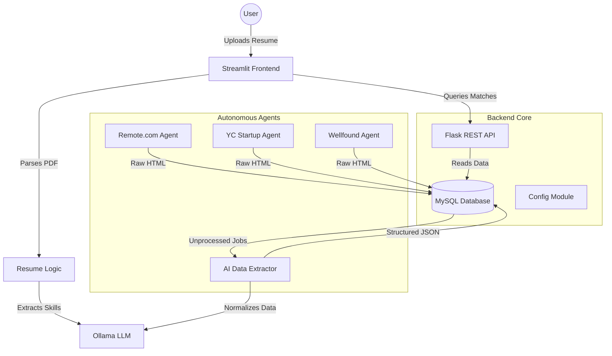

# 🧠 Career Cortex
### The Open-Source Autonomous AI Agent for Hyper-Personalized Job Hunting

[](https://www.python.org/downloads/)
[](https://opensource.org/licenses/MIT)
[](https://streamlit.io)
[](https://ollama.ai)
[](https://www.mysql.com/)

> **"Stop searching. Start converting."**

---

## 💡 The Problem
The modern job search is broken. 
- **Keyword spamming** resumes get rejected by ATS.
- **Generic job boards** are flooded with noise.
- **Manual applications** take hours for minimal yield.
- Candidates apply to jobs they are **only 40% qualified for**, wasting everyone's time.

## 🚀 The Solution: Career Cortex
**Career Cortex** is an intelligent, autonomous agent that reverses the hiring funnel. instead of you searching for jobs, the *jobs find you* based on deep semantic matching of your actual skills against parsed job requirements.

It doesn't just match keywords; it understands **context**. It knows that `React` implies `JavaScript`, and that `PostgreSQL` means you understand `Relational Databases`.

### Key Differentiators
- **Autonomous Scraping**: Custom selenium-based scrapers for high-quality boards (Remote.com, YC, Wellfound).
- **Local LLM Privacy**: Runs entirely on your machine using **Ollama (Llama 3 / Qwen 2.5)**. No data leaves your network.
- **Semantic Matching**: Vector-like quality matching without the overhead of vector DBs, using intelligent set theory and semantic normalization.
- **Resume-First Architecture**: Upload your PDF, and the AI builds your profile automatically.

---

## 🏗️ Architecture

The system is built on a modular, event-driven architecture designed for scale.



---

## ✨ Features

### 1. 🕷️ Multi-Source Intelligent Scraping
- **Remote.com**: Filters for global remote work.
- **Y Combinator**: Targets high-growth startups only.
- **Wellfound**: AngelList integration for startup roles.
- *Anti-detection mechanisms* built-in (randomized delays, user-agent rotation).

### 2. 🧠 LLM-Powered Extraction
- Converts messy, unstructured HTML into **pristine JSON**.
- Normalizes skills (e.g., "React.js", "ReactJS", "React" -> `React`).
- Detects salary ranges, equity, and remote policies automatically.
- **Zero-Hallucination Protocol**: Uses strict JSON schema enforcement with local LLMs.

### 3. 🎯 Semantic Skill Gap Analysis
- Tells you *exactly* why you aren't a 100% match.
- **"The Missing Link"**: Identifies the 1-2 skills standing between you and an interview (e.g., "You have Python and AWS, but you're missing **Kubernetes**").

### 4. ⚡ Production-Ready API
- **RESTful Endpoints**: Fully documented API.
- **Health Checks**: `/health` endpoint for Kubernetes/Docker probes.
- **Environment Config**: 12-Factor App principles with `.env` support.

---

## 🛠️ Tech Stack

| Component | Technology | Why? |
|-----------|------------|------|
| **Generative AI** | **Ollama** (Llama 3 / Qwen) | Free, private, low-latency, run-anywhere. |
| **Backend** | **Python 3.10+** & **Flask** | Robust ecosystem, fast development, production standard. |
| **Frontend** | **Streamlit** | Rapid prototyping for data apps. |
| **Database** | **MySQL 8.0** | ACID compliance, JSON column support, relational integrity. |
| **Scraping** | **Selenium** & **BS4** | Handles dynamic JS-heavy sites that `requests` cannot. |

---

## 🚀 Quick Start

### Prerequisites
- Python 3.8+
- MySQL Server
- [Ollama](https://ollama.ai) (running locally)

### 1. Clone & Install
```bash
git clone https://github.com/IBM07/HireWire.git
cd HireWire

# Install dependencies (including the new environment manager)
pip install -r requirements.txt
```

### 2. Configure Environment (New!)
We use a secure, production-grade configuration system.

```bash
cp .env.example .env
```
Open `.env` and set your secrets:
```ini
DB_PASSWORD=your_secure_password
OLLAMA_MODEL=qwen2.5:14b
```

### 3. Initialize Database
```sql
CREATE DATABASE job_agent;
-- (See database schema in repo)
```

### 4. Run the Stack
**Terminal 1: The Brain (API)**
```bash
python api.py
# 🚀 API running at http://localhost:5000
```

**Terminal 2: The Face (Frontend)**
```bash
streamlit run app.py
# ✨ Interact at http://localhost:8501
```

---

## 🔌 API Reference

The backend exposes a clean REST API.

| Method | Endpoint | Description |
|--------|----------|-------------|
| `GET` | `/health` | Production health check (DB + API status) |
| `GET` | `/jobs` | Search & Filter jobs (`?page=1&skills=python`) |
| `GET` | `/stats` | System statistics (Total jobs, Remote count) |

---

## 🔮 Roadmap (Q3 2026)

- [ ] **Docker Compose**: One-click deployment.
- [ ] **Vector Database**: Migrate from MySQL JSON match to Weaviate/ChromaDB for semantic similarity.
- [ ] **Auto-Apply Agent**: Selenium script to fill out Greenhouse/Lever forms automatically.
- [ ] **Email Alerts**: Daily digest of "90%+ Match" jobs.

---

## 🤝 Contributing
We love open source!
1. Fork it.
2. Create your feature branch (`git checkout -b feature/AmazingFeature`).
3. Commit your changes (`git commit -m 'Add some AmazingFeature'`).
4. Push to the branch (`git push origin feature/AmazingFeature`).
5. Open a Pull Request.

---

## 📄 License
Distributed under the MIT License. See `LICENSE` for more information.

---

> Built with ❤️ by **Ibrahim** during the AI Agent Hackathon.
> *Pitching to Y Combinator S26 Batch.*
