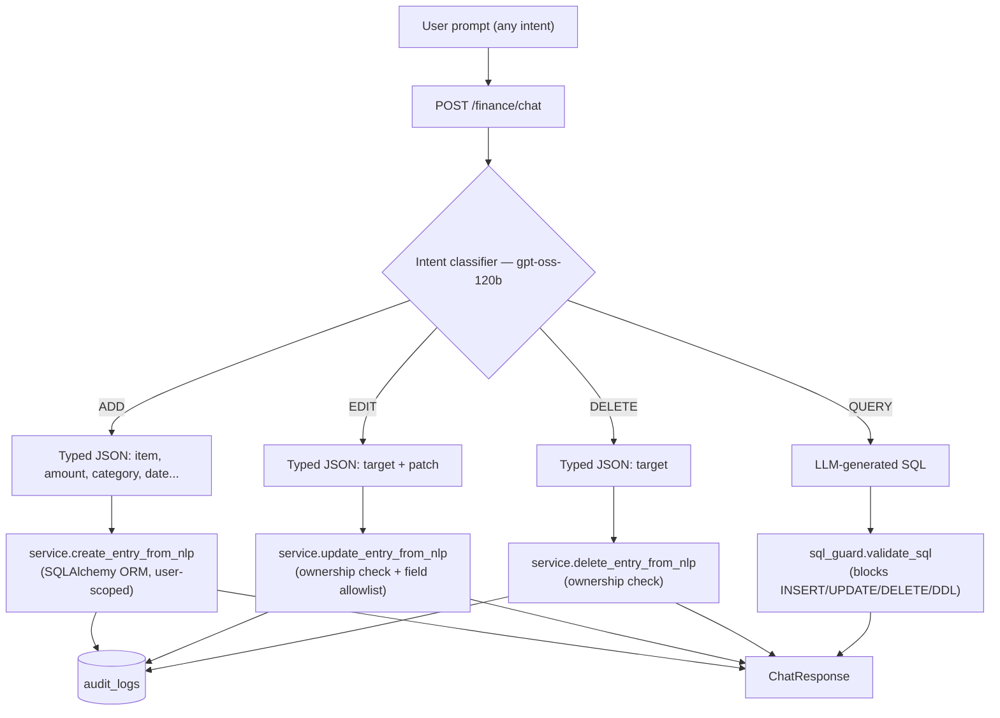

<div align="center">

# 💬 InvoiceFlow

**Talk to your money.**

A full-stack, multi-user finance tracker where you add, edit, and delete transactions —
and query your spending — entirely in plain English. No forms. No SQL. No trust in
an LLM to touch your database directly, either — see [how it works](#-how-it-works) below.

[](#-license)
[](https://github.com/IBM07/nlp-finance-tracker/commits/main)


```
"Add 500 Zomato dinner"        → ✦ Added "Zomato dinner" · ₹500.00 · Food & Dining
"What did I spend last week?"  → ✦ Found 12 records.
"Delete my Zomato expense"     → ⚠ I found multiple matches. Which one did you mean?
```

[Quickstart](#-quickstart) · [How it works](#-how-it-works) · [API](#-api-endpoints) ·
[Testing](#-testing) · [Deployment](#-deployment) · [Security](#-security-model)

</div>

---

## ✨ Features

| | |
|---|---|
| 🗣️ **Conversational everything** | Add, edit, delete, and query transactions from one prompt bar — not just read-only chat over a form-based write path. |
| 🛡️ **LLM never writes mutative SQL** | Mutations go LLM → typed JSON → Pydantic validation → SQLAlchemy ORM. The model physically cannot emit an `UPDATE`/`DELETE` statement — see [How it works](#-how-it-works). |
| ↩️ **10-second Undo on everything** | Every ADD/EDIT/DELETE — chat-triggered or manual — gets an optimistic UI update and a 10s Undo toast before it's final. |
| 🤔 **Disambiguation, not guessing** | "Delete my Zomato expense" with 3 matching entries → a picker, not a coin flip. |
| 📜 **Full audit trail** | Every AI-triggered mutation is logged to an append-only `audit_logs` table — previous state, new state, and the exact prompt that caused it. |
| 🔒 **Ownership enforced everywhere** | Every read/write is scoped to the JWT-authenticated user at the ORM layer — a foreign `target_id` fails exactly like a nonexistent one. |
| 🚦 **Rate-limited by design** | 10 req/min on the LLM-backed chat endpoint, 60 req/min elsewhere — configured, not aspirational. |

## 🧠 How it works

> [!IMPORTANT]
> The LLM is a **parser**, never a SQL writer, for anything that mutates data. This is the
> single most important architectural decision in this codebase.



- **ADD / EDIT / DELETE** never touch LLM-generated SQL at all — the model outputs JSON,
  Pydantic validates the shape (and, for EDIT, a strict field allowlist), and a plain
  SQLAlchemy ORM call — parameterized and `user_id`-scoped by construction — does the write.
- **QUERY** is the one path where the LLM does generate SQL, and it's the *only* path where
  that's allowed — it still passes through a dedicated guard that rejects anything but a single
  scoped `SELECT` (no chaining, no comments-as-injection, no DDL, no unknown tables).
- Ambiguous EDIT/DELETE targets (multiple fuzzy matches) return `CONFIRM_NEEDED` with candidates
  instead of guessing — nothing is mutated until the user picks one.

<details>
<summary><b>Why not just let the LLM write safer, sandboxed SQL?</b></summary>

Because "the guard is 99% accurate" isn't good enough when the failure mode is a wiped-out
financial history. A parser that outputs `{"intent": "DELETE", "target_id": 142}` has no syntax
to escalate into `DELETE FROM finance_entries` — the vulnerability class simply isn't reachable
from that surface. Full reasoning in `prod_ready_plan/nlp_transaction_feature_plan.md`.
</details>

## 🧰 Tech stack

**Backend** — FastAPI · SQLAlchemy + Alembic · PostgreSQL ([Neon](https://neon.tech), SQLite for local dev)
· JWT auth with refresh rotation/revocation · Groq (`gpt-oss-120b`) for intent extraction & NL→SQL
· `slowapi` rate limiting

**Frontend** — React + Vite · React Router · Axios · Recharts

<details>
<summary><b>📁 Project structure</b></summary>

```
nlp-finance-tracker/
├── backend/
│   ├── app/
│   │   ├── auth/           # signup/login, JWT, token rotation
│   │   ├── finance/
│   │   │   ├── intent.py     # LLM intent extraction (QUERY/ADD/EDIT/DELETE) — the security boundary
│   │   │   ├── llm.py        # NL → SQL generation for QUERY intent
│   │   │   ├── sql_guard.py  # Validates/blocks LLM-generated SQL (QUERY path only)
│   │   │   ├── service.py    # Business logic: create/update/delete, audit logging
│   │   │   └── routes.py     # /finance/chat, /finance/entries/{id}, /finance/query, ...
│   │   ├── middleware/     # rate limiting
│   │   ├── config.py       # env-var driven settings (pydantic-settings)
│   │   ├── database.py
│   │   ├── models.py        # FinanceEntry, User, AuditLog
│   │   └── main.py         # FastAPI app entrypoint
│   ├── alembic/             # DB migrations
│   ├── tests/                # auth, finance, sql_guard, intent extraction, NLP mutations, rate limiting
│   ├── requirements.txt
│   └── .env.example
└── frontend/
    ├── src/
    │   ├── api/             # axios client
    │   ├── components/
    │   │   ├── ChatInput.jsx            # unified prompt bar → POST /finance/chat
    │   │   ├── AIActionFeedback.jsx     # Undo toast (10s countdown)
    │   │   ├── DisambiguationPanel.jsx  # candidate picker for ambiguous edit/delete
    │   │   ├── AddTransactionModal.jsx  # manual add + edit mode
    │   │   └── RecentActivityTable.jsx  # inline edit/delete icons
    │   ├── context/         # auth context
    │   ├── pages/           # Login, Signup, Dashboard
    │   └── config.js
    ├── package.json
    └── .env.example
```

</details>

## 🚀 Quickstart

<details open>
<summary><b>Backend</b></summary>

```bash
cd backend
python -m venv venv
venv\Scripts\activate        # Windows
# source venv/bin/activate   # macOS/Linux
pip install -r requirements.txt

cp .env.example .env         # fill in GROQ_API_KEY, JWT_SECRET, etc.
alembic upgrade head         # run DB migrations

uvicorn app.main:app --reload
```

API at `http://localhost:8000` · interactive docs at `http://localhost:8000/docs`

</details>

<details open>
<summary><b>Frontend</b></summary>

```bash
cd frontend
npm install
cp .env.example .env         # point at your backend API URL
npm run dev
```

App at `http://localhost:5173`

</details>

## 📡 API endpoints

<details>
<summary>Expand endpoint table</summary>

| Method | Route | Description | Rate limit |
|---|---|---|---|
| `POST` | `/finance/chat` | Unified conversational endpoint — classifies QUERY/ADD/EDIT/DELETE and executes | 10/min |
| `POST` | `/finance/query` | Legacy read-only NL→SQL query (kept for backwards compatibility) | 30/min |
| `POST` | `/finance/entries` | Manually create a transaction | 60/min |
| `PUT` | `/finance/entries/{id}` | Manually update a transaction (also used by the Undo flow) | 60/min |
| `DELETE` | `/finance/entries/{id}` | Manually delete a transaction (also used by the Undo flow) | 60/min |
| `GET` | `/finance/recent` | Most recent transactions for the authenticated user | 60/min |
| `GET` | `/finance/analytics` | Spending breakdown by category | 60/min |
| `GET` | `/finance/summary` | Dashboard KPI cards — current vs. previous month revenue/expenses/net-profit/savings-rate, plus all-time entry count and largest expense | 60/min |
| `POST` | `/auth/signup` `/auth/login` `/auth/refresh` `/auth/logout` `/auth/change-password` | Auth flows | — |

All finance routes require a `Bearer` JWT and are scoped to the authenticated user — no
cross-user data is ever reachable through any of them.

</details>

## 🔧 Environment variables

<details>
<summary>Expand variable list</summary>

| Variable | Description |
|---|---|
| `GROQ_API_KEY` | Groq API key for LLM-powered intent extraction and query parsing |
| `DATABASE_URL` | Postgres (Neon) or SQLite connection string |
| `JWT_SECRET` | Signs access/refresh tokens — generate with `python -c "import secrets; print(secrets.token_hex(32))"` |
| `JWT_ALGORITHM` | JWT signing algorithm (default `HS256`) |
| `ACCESS_TOKEN_EXPIRE_MINUTES` | Access token lifetime |
| `ALLOWED_ORIGINS` | Comma-separated allowed CORS origins — **never `*` in production** |

**Never commit `.env` files.** Both `backend/.env` and `frontend/.env` are gitignored.

</details>

## 🧪 Testing

```bash
cd backend
pytest
```

Runs against a **real Neon Postgres database** (see `tests/conftest.py` — all test data uses
`@testdomain.dev` emails and is wiped after every test; no SQLite/mock substitution, so what
passes is what ships). Covers:

- ✅ Auth flows and cross-user data isolation
- ✅ The SQL guard layer — INSERT/UPDATE/DELETE/DROP, comment injection, statement chaining
- ✅ LLM intent extraction — valid intents, adversarial/malformed LLM output, jailbreak attempts
- ✅ NLP-triggered ADD/EDIT/DELETE, ownership enforcement, audit log writes, disambiguation
- ✅ Rate limiting on `/finance/chat`

> The LLM call itself is mocked in these tests (standard practice — no flakiness/cost from a
> live model call). Everything downstream of it — routing, ownership checks, DB writes, audit
> logging — is exercised against real infrastructure, not a stub.

## 🌍 Deployment

[](https://render.com/deploy)

`render.yaml` is a ready-to-use [Render Blueprint](https://render.com/docs/blueprint-spec):

1. Push this repo to GitHub.
2. On Render: **New → Blueprint**, point at this repo.
3. Set `GROQ_API_KEY`, `DATABASE_URL` (Neon connection string), `JWT_SECRET`, and
   `ALLOWED_ORIGINS` (your deployed frontend URL) in the Render dashboard — never in source.
4. Render runs `alembic upgrade head` before starting `uvicorn`, so migrations always apply
   before the new version serves traffic.

The frontend is a static Vite build — point `VITE_API_URL` at your deployed backend and ship it
to any static host (Cloudflare Pages, Vercel, Netlify).

## 🔐 Security model

- **The LLM never generates mutative SQL.** ADD/EDIT/DELETE are classified into typed JSON,
  Pydantic-validated, and executed via the SQLAlchemy ORM — parameterized and scoped to the
  JWT-derived `user_id` by construction.
- Every EDIT/DELETE re-validates ownership server-side — a foreign `target_id` is rejected
  exactly like a nonexistent one, so an ID response never leaks whether it belongs to someone else.
- EDIT patches are restricted to an explicit field allowlist, enforced twice: once at the LLM
  output boundary, once again immediately before the DB write.
- All secrets load from environment variables — nothing hardcoded in source.
- JWT access tokens are short-lived; refresh tokens support rotation and revocation.
- CORS origins are configurable per environment — no wildcard in production.

## 📄 License

This project is licensed under the MIT License — see the [LICENSE](LICENSE) file for details.
